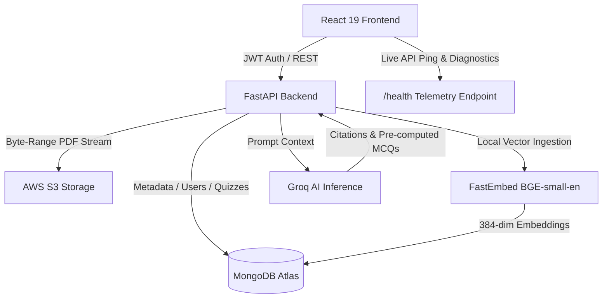

<div align="center">

# 🧠 DocMind AI
### **Smart Document Workspace, Practice Studio & Telemetry Engine**

[](https://reactjs.org/)
[](https://fastapi.tiangolo.com/)
[](https://python.langchain.com/)
[](https://groq.com/)
[](https://aws.amazon.com/s3/)
[](https://www.mongodb.com/)

---

**DocMind AI** is an intelligent workspace designed for reading, querying, and reviewing long PDF documents. Upload your files to ask questions, pull exact citations, generate practice quizzes with zero-latency pre-computed explanations, and inspect live backend telemetry.

</div>

---

## 💡 Why DocMind AI?

Traditional document workflows require manual Ctrl+F searches, disjointed note-taking, and slow revision cycles. **DocMind AI** unifies document storage, semantic search, self-assessment, and system telemetry into a clean workspace:

* 🔍 **Instant Answers with Source Quotes**: Ask questions across a single PDF or your whole library. DocMind scans document text and provides exact page-level citations.
* ⚡ **Pre-computed MCQ Explanations**: Quizzes pre-generate explanations during creation, delivering **0ms instant feedback** and saving ~90% of LLM token costs.
* 📊 **Live System Telemetry & Diagnostics**: Dedicated Telemetry tab with live API ping diagnostic tests, FastEmbed vector counts, and S3 streaming metrics.
* 💬 **Optimized Chat Studio**: Centered 820px reading container with compact `fit-content` bubbles, avatars, and keyboard shortcuts.
* 🔎 **Real-time Library & Quiz Search**: Instant search filtering across uploaded documents and generated practice sets.
* 🔒 **Encrypted S3 Infrastructure & Account Profile**: Multi-tenant AWS S3 storage with AES-256 encryption, account settings profile modal, and byte-range proxy streaming.

---

## ✨ Core Capabilities

### 1. Document Q&A & Semantic Search
- **Library-Wide Querying**: Target a single PDF or ask questions across your entire document collection.
- **Citation Tracking**: View exact textual evidence directly alongside AI responses.
- **Optimal Line-Length UX**: Centered chat stream with auto-fitting message bubbles.

### 2. Quiz Studio & Pre-computed Explanations
- **Automated MCQ Generation**: Synthesize 5 to 50 structured practice questions from any PDF excerpt.
- **Zero-Latency Explanations**: Explanations pre-computed upfront render instantly on clicking **"Explain"**.
- **Score Tracking & Question Notes**: Save past quiz attempts, review incorrect questions, and auto-save personal study notes.

### 3. System Telemetry & Diagnostic Engine
- **Live Health Diagnostics**: Test API roundtrip ping latency in milliseconds (`ms`).
- **Vector & RAG Specs**: Monitor active FastEmbed chunks (`BAAI/bge-small-en-v1.5` · 384-dim) and MongoDB Atlas `$vectorSearch` status.
- **Storage Metrics**: View real-time S3 storage volume and HTTP 206 byte-range streaming state.

### 4. AWS S3 Storage & Byte-Range Streaming
- **Zero-Memory PDF Streaming**: Authenticated byte-range requests stream heavy PDFs directly from AWS S3 without server RAM bottlenecks.
- **Terraform Infrastructure**: Fully reproducible IaC modules (`infra/terraform/`) for AWS S3 bucket provisioning, SSE-AES256 encryption, and lifecycle management.

### 5. Workspace Security & Account Profile
- **Account Settings Modal**: Edit display name with live state sync, view role badges, and inspect workspace domain.
- **Role-Based Access Control**: Manage team members, toggle active status, and send email invite tokens.

---

## 🛠️ Architecture Overview



---

## 🚀 Getting Started

### Prerequisites
- Python 3.11+ / Poetry
- Node.js 20+ / npm
- Docker & Docker Compose (for containerized deployment)
- MongoDB Atlas Cluster (or local Docker MongoDB)
- AWS S3 Bucket & Groq API Key

---

### 🐳 Option A: Docker Deployment (Recommended)

Run the full multi-container stack (MongoDB + FastAPI Backend + React/Nginx Frontend) with a single command:

```bash
# 1. Clone the repository
git clone https://github.com/Pritii-9/pdf-streaming.git
cd pdf-streaming

# 2. Configure environment variables (optional)
cp backend/.env.example backend/.env

# 3. Build and launch all services with Docker Compose
docker-compose up --build -d
```

#### Running Services:
- **Frontend App**: [http://localhost:5173](http://localhost:5173) (or `http://localhost:80`)
- **FastAPI OpenAPI Specs**: [http://localhost:8000/docs](http://localhost:8000/docs)
- **MongoDB Instance**: `localhost:27017`

To stop and remove containers:
```bash
docker-compose down -v
```

---

### 💻 Option B: Manual Local Setup

#### 1. Backend Setup
```bash
cd backend
poetry install
poetry run uvicorn main:app --reload --port 8000
```

#### 2. Frontend Setup
```bash
cd frontend
npm install
npm run dev
```

#### 3. Run Backend Unit & Integration Tests
```bash
cd backend
poetry run pytest -v
```

#### 4. Infrastructure Provisioning (Optional)
```bash
cd infra/terraform
terraform init
terraform apply -var-file="terraform.tfvars.example"
```

---

<div align="center">
  <sub>Engineered by **DocMind AI Team** • © 2026 DocMind AI</sub>
</div>
