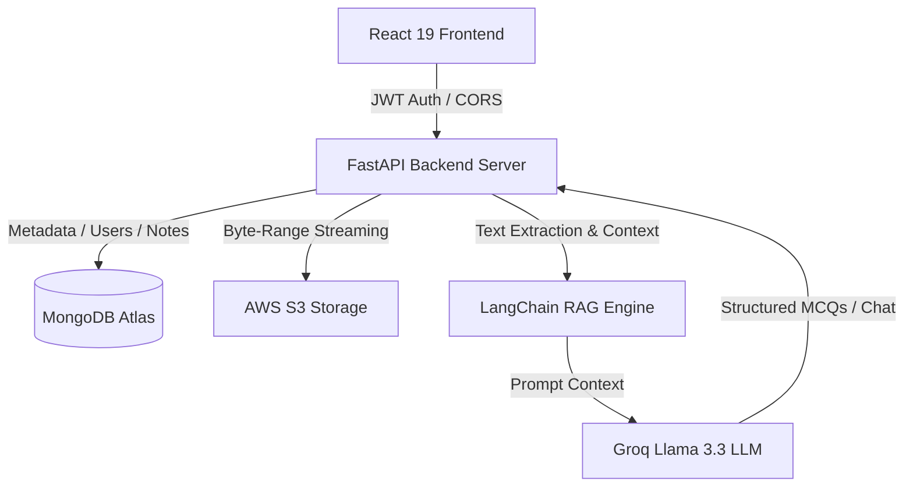

<div align="center">

# 🧠 DocMind AI
### **Enterprise Neural Document Intelligence & Interactive Assessment Platform**

[](https://reactjs.org/)
[](https://fastapi.tiangolo.com/)
[](https://python.langchain.com/)
[](https://groq.com/)
[](https://aws.amazon.com/s3/)
[](https://www.mongodb.com/)

---

**DocMind AI** is a high-throughput, enterprise-grade Document Intelligence and Assessment platform. It integrates secure byte-range PDF streaming from AWS S3, real-time RAG (Retrieval-Augmented Generation) document query capabilities, and an AI-driven Quiz & Mock Test Studio with persistent study notes.

</div>

---

## ✨ Enterprise Capabilities

### 🧠 1. AI Quiz Studio & Mock Test Generation
- **Automated MCQ Generation**: Dynamically extracts semantic context from multi-page PDFs to synthesize structured, high-yield Multiple Choice Questions (MCQs).
- **Explanation Engine**: Instant, detailed rationale for correct vs. incorrect options to accelerate concept mastery.
- **Persistent Essential Notes**: Integrated rich notes module per question with debounced auto-saving to MongoDB.

### 🤖 2. LangChain RAG & Document Chat
- **RAG Architecture**: Vector-embedded semantic search against uploaded PDFs using LangChain and Groq Llama 3.3.
- **Streaming Responses**: Real-time response generation via Server-Sent Events (SSE).

### 🔒 3. AWS S3 Byte-Range Streaming & Infrastructure (IaC)
- **Zero-Copy Byte-Range Streaming**: Authenticated byte-range requests stream heavy PDFs directly from AWS S3 without loading full files into backend memory.
- **Terraform Infrastructure (IaC)**: Includes `infra/terraform/` modules for AWS S3 provisioning with SSE-AES256 encryption, strictly blocked public access, CORS rules, and 30-day lifecycle transitions.

### 🛡️ 4. Multi-Tenant Enterprise Security
- **Bcrypt Hashing**: Safe, enterprise password hashing with robust 72-byte truncation compatibility.
- **Role-Based Access Control (RBAC)**: Admin and User scopes with OTP email verification and invite token activation workflows.

---

## 🛠️ System Architecture



---

## 🚀 Getting Started

### Prerequisites
- Python 3.11+ / Poetry
- Node.js 18+ / npm
- MongoDB Atlas Cluster
- AWS S3 Credentials & Groq API Key

### Backend Setup
```bash
cd backend
poetry install
poetry run uvicorn main.py:app --reload --port 8000
```

### Frontend Setup
```bash
cd frontend
npm install
npm run dev
```

### Terraform Infrastructure Deployment
```bash
cd infra/terraform
terraform init
terraform apply -var-file="terraform.tfvars.example"
```

---

<div align="center">
  <sub>Engineered by **Priti** • © 2026 DocMind AI Systems</sub>
</div>
