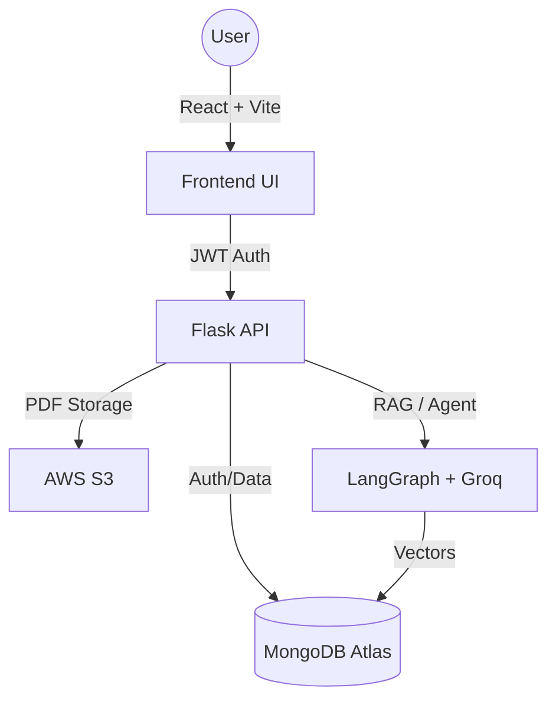

<div align="center">

# 🔒 SafeUp
### **Secure Document Workspace & Streaming Platform**

[](https://reactjs.org/)
[](https://flask.palletsprojects.com/)
[](https://www.mongodb.com/)
[](https://aws.amazon.com/s3/)
[](https://langchain-ai.github.io/langgraph/)

---

**SafeUp** is a multi-tenant document management platform. It combines authenticated PDF streaming with a LangGraph-powered chat interface, allowing users to securely store files and query their workspace data.

[**Live Demo**](https://pdf-streaming.vercel.app/) • [**Features**](#-features) • [**Tech Stack**](#-tech-stack) • [**Architecture**](#-architecture) • [**Setup**](#-local-setup)

</div>

## 📸 Preview

<div align="center">
  
  <br />
  <em>Workspace dashboard with real-time activity feed and document chat.</em>
  <br /><br />
  
  <br />
  <em>Secure authentication flow with multi-tenant workspaces.</em>
</div>

---

## ✨ Features

### 🤖 AI & Search
- **Workspace Agent**: Powered by LangGraph to let users query their documents and track workspace activity.
- **Document Chat (RAG)**: Extracts information from uploaded PDFs using semantic search and cloud-based embeddings.
- **Streaming Responses**: Delivers real-time chat output using Server-Sent Events (SSE).

### 🔒 Security & Access
- **Secure File Streaming**: PDFs are never exposed via public URLs. They are streamed directly from AWS S3 using authenticated byte-range requests.
- **Data Isolation**: Documents and user data are strictly isolated by workspace.
- **Admin Controls**: Includes invite-based onboarding, user activation toggles, and OTP verification.

### 📊 Dashboard & Monitoring
- **Usage Metrics**: Tracks storage usage, document counts, and active team members.
- **Live Activity Feed**: Broadcasts real-time updates for workspace events (like file uploads) via SSE.
- **Built-in Viewer**: Integrated PDF viewer supporting zoom, rotation, and secure rendering.

---

## 🛠️ Tech Stack

### Frontend
- **Framework:** React 18 (Vite)
- **Styling:** Vanilla CSS (Glassmorphism, Dark Mode)
- **Icons:** Lucide React
- **State:** React Hooks & SSE Listeners

### Backend
- **Server:** Flask (Python 3.11+)
- **WSGI:** Gunicorn + Gevent (for concurrent SSE)
- **Auth:** JWT (flask-jwt-extended)
- **Storage:** AWS S3 (boto3)
- **Database:** MongoDB Atlas (pymongo)

### AI Pipeline
- **Orchestration:** LangGraph
- **RAG:** LangChain & Sentence Transformers
- **Embeddings:** Nomic-Embed-Text / Groq API
- **LLM:** Groq Llama 3.3

---

## 🏗️ Architecture



---

## 🚀 Local Setup

### Backend
1. **Navigate & Install dependencies:**
   ```bash
   cd backend
   poetry install
   ```
2. **Environment Configuration:**
   Create a `.env` file based on `.env.example.txt` with your MongoDB, AWS, and Groq keys.
3. **Launch the server:**
   ```bash
   poetry run python main.py
   ```

### Frontend
1. **Navigate & Install dependencies:**
   ```bash
   cd frontend
   npm install
   ```
2. **Launch the development server:**
   ```bash
   npm run dev
   ```

---

## 💼 Project Goal
SafeUp was built to provide a secure environment for managing and querying sensitive documents. By eliminating public S3 links and using a strictly authenticated backend, it allows teams to safely collaborate and extract insights from their data without compromising security.

---

<div align="center">
  <sub>Built by **Priti** • © 2026 SafeUp Systems Inc.</sub>
</div>
