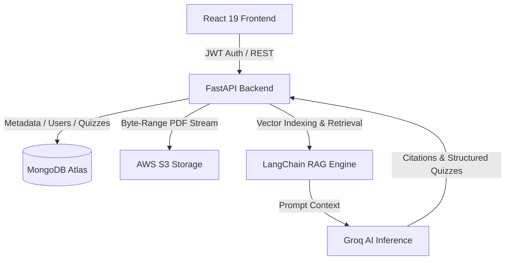

<div align="center">

# 🧠 DocMind AI
### **Smart Document Workspace & Practice Studio**

[](https://reactjs.org/)
[](https://fastapi.tiangolo.com/)
[](https://python.langchain.com/)
[](https://groq.com/)
[](https://aws.amazon.com/s3/)
[](https://www.mongodb.com/)

---

**DocMind AI** is an intelligent workspace designed for reading, querying, and reviewing long PDF documents. Instead of scanning through hundreds of pages manually, upload your files to ask questions, pull exact citations, and generate practice quizzes in seconds.

</div>

---

## 💡 Why DocMind AI?

Traditional document workflows require manual Ctrl+F searches, disjointed note-taking, and slow revision cycles. **DocMind AI** unifies document storage, semantic search, and self-assessment into a clean workspace:

* 🔍 **Instant Answers with Source Quotes**: Ask questions across a single PDF or your whole library. DocMind scans document text and provides exact page-level citations.
* 📚 **Turn Documents into Quizzes**: Automatically convert complex PDFs into structured multiple-choice practice sets complete with step-by-step explanations.
* ⚡ **Sub-Second Performance**: Powered by Groq fast inference (`groq/compound`) and local vector indexing for low-latency search and answer generation.
* 🔒 **Encrypted S3 Infrastructure**: Multi-tenant AWS S3 storage with AES-256 encryption, role-based workspace permissions, and secure byte-range streaming.
* 🎨 **Clean, Focused UI**: Built with a sleek navy accent palette, Inter typography, and intuitive custom components without noisy visual clutter.

---

## ✨ Core Capabilities

### 1. Document Q&A & Semantic Search
- **Library-Wide Querying**: Target a single PDF or ask questions across your entire document collection.
- **Citation Tracking**: View exact textual evidence directly alongside AI responses.

### 2. Quiz Studio & Self-Assessment
- **Automated MCQ Generation**: Synthesize 5 to 20 structured practice questions from any PDF excerpt.
- **Detailed Explanations**: Review correct choices and understand key concepts instantly.
- **Score Tracking**: Save past quiz attempts and track mastery over time.

### 3. AWS S3 Storage & Byte-Range Streaming
- **Zero-Memory PDF Streaming**: Authenticated byte-range requests stream heavy PDFs directly from AWS S3 without memory bottlenecks.
- **Terraform Infrastructure**: Fully reproducible IaC modules (`infra/terraform/`) for AWS S3 bucket provisioning, SSE-AES256 encryption, and lifecycle management.

### 4. Workspace Access & Security
- **Role-Based Access Control**: Manage team members, toggle active status, and send email invite tokens.
- **Session Protection**: Custom confirmation dialogs and OTP authentication flows.

---

## 🛠️ Architecture Overview



---

## 🚀 Getting Started

### Prerequisites
- Python 3.11+ / Poetry
- Node.js 18+ / npm
- MongoDB Atlas Cluster
- AWS S3 Bucket & Groq API Key

### 1. Backend Setup
```bash
cd backend
poetry install
poetry run uvicorn main:app --reload --port 8000
```

### 2. Frontend Setup
```bash
cd frontend
npm install
npm run dev
```

### 3. Infrastructure Provisioning (Optional)
```bash
cd infra/terraform
terraform init
terraform apply -var-file="terraform.tfvars.example"
```

---

<div align="center">
  <sub>Engineered by **DocMind AI Team** • © 2026 DocMind AI</sub>
</div>
