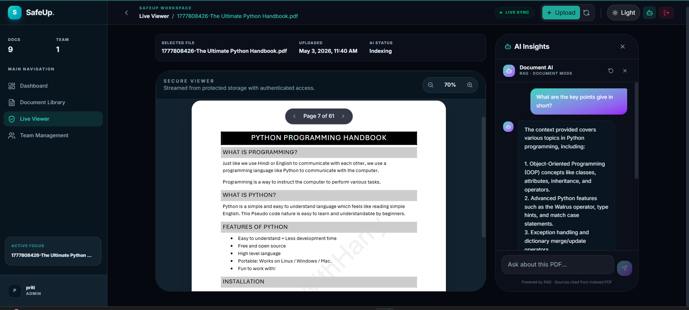
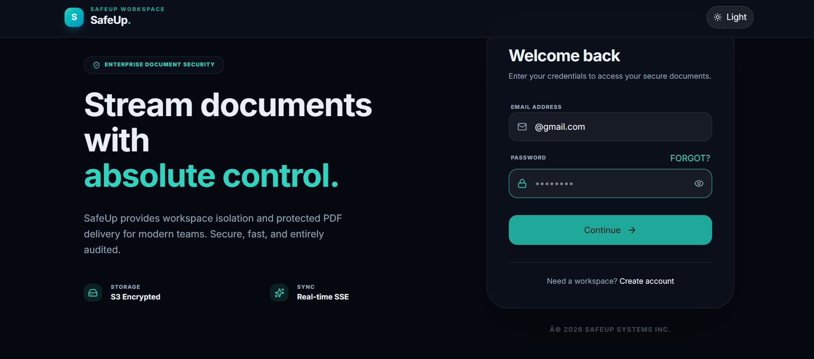

<div align="center">

# 🔒 SafeUp
### **Enterprise-Grade AI Document Workspace**

[](https://reactjs.org/)
[](https://flask.palletsprojects.com/)
[](https://www.mongodb.com/)
[](https://aws.amazon.com/s3/)
[](https://langchain-ai.github.io/langgraph/)

---

**SafeUp** is a sophisticated, multi-tenant document intelligence platform. It combines secure, authenticated PDF streaming with cutting-edge AI capabilities—featuring an autonomous LangGraph agent for workspace-wide querying and RAG (Retrieval-Augmented Generation) for deep document insights.

[**Explore Features**](#-key-features) • [**Tech Stack**](#-tech-stack) • [**Architecture**](#-architecture) • [**Setup**](#-local-setup)

</div>

## 📸 Preview

<div align="center">
  
  <br />
  <em>The intelligent AI workspace featuring real-time document indexing and RAG-powered chat.</em>
  <br /><br />
  
  <br />
  <em>A secure, enterprise-grade authentication gateway with multi-tenant isolation.</em>
</div>

---

## ✨ Key Features

### 🧠 AI Intelligence Suite
- **LangGraph Command Center**: An autonomous agent that understands your entire workspace. Query documents, analyze team activity, and extract insights across multiple files.
- **Precision RAG**: Deep document understanding using semantic search and local embeddings (all-MiniLM-L6-v2).
- **Streaming Responses**: Real-time AI output using Server-Sent Events (SSE) for a fluid, chatty experience.

### 🛡️ Enterprise Security
- **Authenticated Streaming**: PDFs are never exposed via public URLs. They are streamed directly from S3 using byte-range requests for performance and absolute security.
- **Multi-Tenant Isolation**: Cryptographically separated workspaces ensure that data and team members are strictly isolated between organizations.
- **Admin Controls**: Robust invite-based onboarding, account lifecycle management (activate/deactivate), and OTP verification.

### 📊 Operations Dashboard
- **Real-time Analytics**: Monitor storage footprint, document count, and team engagement at a glance.
- **Live Activity Feed**: Stay updated with workspace events (uploads, invites, joins) as they happen via SSE.
- **Secure Viewer**: High-performance PDF viewer with zoom, rotation, and authenticated streaming.

---

## 🛠️ Tech Stack

### Frontend
- **Framework:** React 18 (Vite)
- **Styling:** Premium Vanilla CSS (Glassmorphism, Dark Mode)
- **Icons:** Lucide React
- **State:** React Hooks & SSE Listeners

### Backend
- **Server:** Flask (Python 3.11+)
- **WSGI:** Gunicorn + Gevent (for high-concurrency SSE)
- **Auth:** JWT (flask-jwt-extended)
- **Storage:** AWS S3 (boto3)
- **Database:** MongoDB Atlas (pymongo)

### AI & Data
- **Orchestration:** LangGraph (Stateful Agents)
- **RAG Pipeline:** LangChain & Sentence Transformers
- **Embeddings:** all-MiniLM-L6-v2 (Local Execution)
- **LLM:** Groq Llama 3.3 (High-performance inference)

---

## 🏗️ Architecture


---

## 🚀 Local Setup

### Backend
1. **Navigate & Install:**
   ```bash
   cd backend
   poetry install
   ```
2. **Environment Configuration:**
   Create a `.env` file based on `.env.example.txt` with your MongoDB, AWS, and Groq keys.
3. **Launch Server:**
   ```bash
   poetry run python main.py
   ```

### Frontend
1. **Navigate & Install:**
   ```bash
   cd frontend
   npm install
   ```
2. **Launch Dev Server:**
   ```bash
   npm run dev
   ```

---

## 💼 Business Value (CEO View)
SafeUp is a **governance-first** document intelligence platform. It solves the risk of sensitive file leaks by eliminating public S3 URLs and replaces static folders with a **self-aware workspace**. It improves team efficiency by allowing members to talk to their data, reducing "time-to-information" while maintaining enterprise-grade compliance and auditability.

---

<div align="center">
  <sub>Built by **Priti** • © 2026 SafeUp Systems Inc.</sub>
</div>
