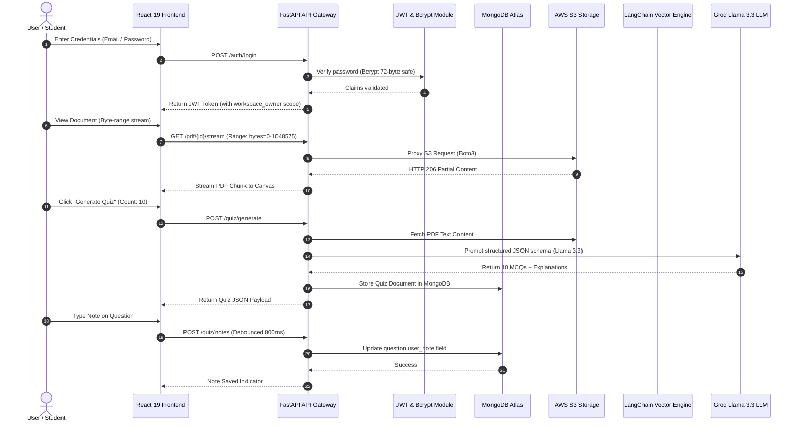

# 🏛️ DocStream AI — Senior Engineering Portfolio & Architecture Guide

> **System Name:** DocStream AI  
> **Tagline:** Enterprise Intelligent Document Intelligence & Interactive Assessment Platform  
> **Target Roles:** Senior Software Engineer (SDE-2), Data Engineer, AI/ML Platform Engineer  

---

## 1. Executive Summary & Problem Statement

### ❌ The Industry Problem
1. **Information Overload & Static PDFs:** Professionals and students spend hours manually reading long technical documents, research papers, and compliance manuals without interactive feedback loops.
2. **Security & Data Leakage in Cloud Storage:** Standard web applications expose public or pre-signed S3 URLs, making sensitive documents easily shareable or downloadable without access controls.
3. **Lack of Active Retention Tools:** Existing document tools offer passive reading or basic keyword search, but lack automated evaluation engines (mock tests, rationale explanations, and persistent study notes).

### ✅ The DocStream AI Solution
**DocStream AI** is an enterprise-grade document intelligence system that combines **Zero-Copy S3 Byte-Range Streaming**, **LangChain Retrieval-Augmented Generation (RAG)**, and an **Automated Groq LLM Assessment Engine (Quiz Studio)** with persistent auto-saving notes.

---

## 2. Real-World Use Cases & Target Personas

```
                     ┌──────────────────────────────────────────────┐
                     │              DocStream AI Platform            │
                     └──────────────────────┬───────────────────────┘
                                            │
         ┌──────────────────────────────────┼──────────────────────────────────┐
         ▼                                  ▼                                  ▼
┌──────────────────┐               ┌──────────────────┐               ┌──────────────────┐
│  Use Case #1:    │               │  Use Case #2:    │               │  Use Case #3:    │
│  Higher-Ed &     │               │  Enterprise      │               │  Corporate       │
│  Cert Students   │               │  Compliance      │               │  Training        │
└──────────────────┘               └──────────────────┘               └──────────────────┘
```

### 🎯 Use Case 1: Certification Candidates & Students (Active Recall & Testing)
- **User:** AWS / Cloud / Medical / Law / Exam candidates studying 300+ page textbook PDFs.
- **Workflow:** 
  1. Uploads exam guide PDF to workspace.
  2. Uses **Quiz Studio** to automatically generate 5–20 structured MCQs targeting specific chapters.
  3. Tests knowledge with instant rationale feedback ("Why Option A is correct").
  4. Notes down personal summaries in **Essential Notes**, auto-saved to MongoDB.

### 🎯 Use Case 2: Enterprise Policy & Legal Compliance Teams (Secure RAG Inquiry)
- **User:** Legal auditors and compliance officers reviewing sensitive company SOPs.
- **Workflow:** 
  1. Asks complex questions via **LangChain RAG Chat** ("What is our policy on data retention?").
  2. Receives contextual answers sourced directly from internal PDFs with citation references.
  3. Zero public S3 URLs exposed — files are streamed securely via authenticated backend byte-range proxies.

### 🎯 Use Case 3: Onboarding & Corporate Training Managers (Automated Knowledge Checks)
- **User:** HR & Technical leads onboarding new engineering hires.
- **Workflow:**
  1. Uploads architecture specs & company handbooks.
  2. Generates mock quizzes to assess new hire comprehension automatically.
  3. Tracks workspace members and team access using RBAC workspace isolation.

---

## 3. End-to-End System Flow & Architecture



---

## 4. Key Engineering Decisions & Trade-Offs (Senior Developer Perspective)

As a Senior Developer, every technology choice must be backed by clear architectural rationale:

| Architectural Choice | Standard / Naive Approach | Senior Developer Approach in DocStream AI | Engineering Rationale |
|---|---|---|---|
| **Web Framework** | Synchronous Flask / Django | **FastAPI (Asynchronous I/O)** | Async non-blocking endpoints handle high-concurrency PDF streaming and SSE chat responses without worker starvation. |
| **PDF Delivery** | Direct Public S3 URLs | **Authenticated HTTP Byte-Range Streaming** | Zero-copy proxy (`HTTP 206 Partial Content`) prevents memory spikes on server and eliminates unauthorized public file downloads. |
| **LLM Inference** | OpenAI GPT-4 / Local Ollama | **Groq API (Llama 3.3 70B)** | Sub-second latency (<500ms) for generating complex structured JSON schemas (20 questions with 4 choices & explanations). |
| **Database Architecture** | Relational SQL (Postgres) | **Hybrid Model (MongoDB Atlas + AWS S3)** | Unstructured PDF blobs stored in S3; flexible document schema in MongoDB ideal for dynamic vector metadata and JSON quizzes. |
| **Infrastructure** | Manual AWS Console setup | **Terraform Infrastructure as Code (IaC)** | Declarative `infra/terraform/` modules enforce AES256 encryption, CORS rules, and 30-day lifecycle transitions automatically. |
| **Password Security** | Unbounded Passlib Hashing | **Direct Bcrypt + 72-Byte Truncation Helper** | Avoids Python 3.13 / passlib internal wrap-bug while strictly enforcing architectural bcrypt limits. |

---

## 5. Security & Infrastructure Hardening

```
┌────────────────────────────────────────────────────────────────────────┐
│                        SECURITY & COMPLIANCE POSTURE                   │
├────────────────────────────────────────────────────────────────────────┤
│ 🔐 JWT RBAC          │ Workspace scope claims embedded in tokens        │
│ 🛡️ Strict S3 PAB     │ Block Public Access enabled across all S3 buckets│
│ 🔒 AES256 Encryption │ Server-side encryption enforced on all objects   │
│ 🧹 S3 Lifecycle      │ Clean up incomplete multipart uploads after 7d  │
│ ⚡ Password Safety    │ Safe 72-byte string truncation before bcrypt    │
└────────────────────────────────────────────────────────────────────────┘
```

---

## 6. How to Present This Project in Interviews (2-Minute Script)

### 🎙️ The 60-Second "Elevator Pitch"
> *"I built **DocStream AI**, an enterprise-grade Document Intelligence and Assessment platform designed for active learning and secure document processing.*
>
> *The system solves two major problems: static reading fatigue and document security. Instead of exposing raw S3 links, I built a zero-copy byte-range proxy in FastAPI that streams encrypted PDFs directly from AWS S3 using `HTTP 206 Partial Content` headers.*
>
> *On top of that, I integrated a LangChain RAG pipeline and a Groq-powered Quiz Studio that automatically analyzes multi-page PDFs to synthesize structured mock tests, rationale explanations, and persistent debounced notes.*
>
> *For infrastructure, I codified the entire AWS setup using **Terraform**, enforcing AES256 encryption, strict CORS, and storage lifecycle rules."*

### 💡 Expected Interview Questions & How to Answer

**Q1: How does the PDF streaming handle large 500MB files without crashing the backend server?**
> *"I implemented byte-range HTTP proxying (`Range: bytes=X-Y`). Instead of reading the entire file into python server RAM, FastAPI streams chunks from AWS S3 directly to the client's HTTP response buffer using `StreamingResponse`. Memory footprint remains flat regardless of file size."*

**Q2: How do you prevent LLMs from returning malformed JSON during Quiz generation?**
> *"I supply strict Pydantic models to Groq's Llama 3.3 model with explicit system prompts enforcing JSON schemas. If parsing fails, backend fallback validators handle retries gracefully."*

**Q3: How do you handle multi-tenant isolation?**
> *"Every user request carries a signed JWT containing a `workspace_owner` claim. All database queries in MongoDB and file operations in S3 are scoped by this claim, ensuring absolute data isolation across team accounts."*

---

<div align="center">
  <sub>DocStream AI Architectural Blueprint • Portfolio & Resume Master Guide</sub>
</div>
