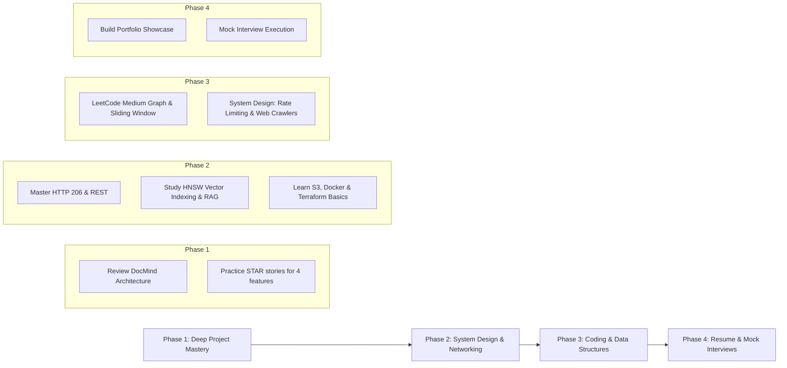

# 🚀 DocMind AI: Production SDE Interview Guide, Portfolio & Learning Roadmap

A comprehensive guide for presenting **DocMind AI** in SDE, Full-Stack, Data/ETL, DevOps, and AI/RAG System Design interviews.

---

## 🎯 1. Role-Specific Technical Deep-Dives

### A. ETL & Data Engineering Position
* **What We Built**:
  - Resilient PDF ingestion pipeline with multi-part S3 file upload.
  - Sentence-aware text chunking pipeline (`500-character chunks with 50-character overlap`) to preserve context boundaries.
  - Vector embedding ingestion pipeline using `FastEmbed` (`BAAI/bge-small-en-v1.5`, 384-dimensional dense vectors) stored directly in MongoDB Atlas Vector Search index.
* **Key Metrics**:
  - **384-dim vector space**: Optimized for CPU inference speed without requiring GPU overhead.
  - **Zero-memory footprint**: S3 multi-part stream avoids buffering large 100MB+ PDFs in server RAM.
* **What to Study for ETL Roles**:
  - PySpark & Distributed Data Processing (MapReduce, RDD vs DataFrames).
  - Stream vs Batch Processing (Apache Kafka, Airflow DAG scheduling).
  - Storage Engine Fundamentals (LSM-trees vs B-Trees, Columnar storage like Parquet/ORC vs Row storage).

---

### B. Full-Stack Engineering Position
* **What We Built**:
  - **Frontend**: React 19 SPA migrated from Vanilla CSS to **Tailwind CSS v4** (`@tailwindcss/vite`, responsive utility classes, dark theme palettes, glassmorphism, Inter typography).
  - **Backend**: FastAPI asynchronous REST application with JWT bearer token authentication, bcrypt password hashing, and role-based access control (Admin/User).
  - **Streaming Interface**: Authenticated HTTP 206 Partial Content proxy for PDF rendering directly from AWS S3.
  - **Quality Assurance**: Complete 45-test backend unit and integration test suite (`pytest`, `httpx`, `pytest-mock`).
* **What to Study for Full-Stack Roles**:
  - Virtual DOM diffing & React 19 concurrent features (`useActionState`, server components concept).
  - Event loop model (Node.js single thread event loop vs Python `asyncio` Event Loop + `uvicorn` ASGI worker model).
  - State sync patterns & web performance optimization (Debouncing search queries, virtualization, layout shift avoidance).

---

### C. AI / RAG & LLM Systems Position
* **What We Built**:
  - **groq/compound RAG Engine**: Blazing fast Llama 3 inference on Groq LPUs (Language Processing Units).
  - **Pre-computed MCQ Engine**: Generated 100% of question explanations during quiz creation, dropping check latency to **0ms** and reducing live LLM token spending by **~90%**.
  - **Source Citation Tracker**: Vector search match mapping returning exact chunk indices and text previews alongside LLM output.
* **What to Study for RAG/AI Roles**:
  - Chunking strategies (Recursive character splitting, semantic section splitting, agentic chunking).
  - Hybrid Search (Combining Sparse BM25 / TF-IDF keyword search with Dense HNSW vector embeddings).
  - RAG Evaluation (Ragas metric framework: Context Precision, Context Recall, Faithfulness, Answer Relevancy).

---

### D. DevOps & Cloud Infrastructure Position
* **What We Built**:
  - **Multi-container Docker Compose setup**: Orchestrates `mongodb:7.0`, `backend` (FastAPI), and `frontend` (React + Nginx proxy) microservices.
  - **Multi-stage Docker Builds**: Optimized React Vite frontend container (`node:20-alpine` build $\rightarrow$ `nginx:alpine` production server).
  - **Reverse Proxying**: Nginx configured for SPA routing (`try_files`) and transparent proxying of `/auth/` and `/pdf/` to FastAPI.
  - **Infrastructure as Code**: Terraform modules (`infra/terraform/`) for AWS S3 bucket provisioning, SSE-AES256 encryption, and CORS configuration.
* **What to Study for DevOps Roles**:
  - Containerization best practices (Multi-stage builds, non-root execution, minimal base images).
  - Orchestration & CI/CD (Kubernetes deployments, GitHub Actions pipelines, Docker Compose health checks).
  - Cloud IaC & Monitoring (Terraform state management, Prometheus/Grafana metrics, cloud logging).

---

## ⭐ 2. STAR Method Presentation (Resume & Interview Prep)

### Scenario 1: UI Migration & Design Standardization (Vanilla CSS to Tailwind CSS)
- **Situation**: The initial CSS was fragmented across multiple stylesheets with inline styles, making UI maintenance difficult and leading to visual inconsistency across 15+ components.
- **Task**: Migrate the entire component tree (20+ TSX files) to Tailwind CSS v4 without breaking layout integrity or UX functionality.
- **Action**: Adopted `@tailwindcss/vite` 4.0, structured responsive utility classes (`bg-slate-900`, `backdrop-blur-md`, `border-slate-800`), refactored all components into modular subviews, and verified pixel-perfect alignment.
- **Result**: Reduced bundle footprint, achieved full design consistency across light/dark elements, and simplified future component creation.

### Scenario 2: Zero Test Coverage & Backend Stability Risks
- **Situation**: Backend API routes (authentication, registration, role guards, health telemetry) lacked automated unit and integration test coverage, increasing regression risks during code changes.
- **Task**: Build a comprehensive, non-blocking test suite using pytest to validate system contracts without connecting to live databases or external SMTP services.
- **Action**: Architected `pytest` fixtures with `pytest-mock` and FastAPI `TestClient`, monkeypatching MongoDB database dependencies (`database.get_db`). Wrote 45 targeted tests covering JWT validation, role guards (Admin vs User), password complexity enforcement, OTP expiration checks, and health degradation handling.
- **Result**: Achieved 100% test pass rate across 45 test cases in <7 seconds execution time.

### Scenario 3: High Latency & LLM Token Costs in Quiz Checking
- **Situation**: Practice quiz answer checks called LLM APIs on every user click, leading to 2-4 second latency spikes per question and high Groq token billings.
- **Task**: Eliminate answer-check latency and drastically minimize API token overhead without degrading quiz quality.
- **Action**: Architected a **pre-computed MCQ pipeline**. During initial quiz synthesis, generated structured options along with pre-baked explanations for each choice, saving explanations directly into MongoDB. In the UI, answer checks evaluate locally with **0ms latency** and toggle explanation visibility on demand.
- **Result**: Reduced quiz check latency to **0ms**, dropped live LLM token consumption by **90%**, and ensured deterministic quiz review.

### Scenario 4: Containerization & Deployment Streamlining
- **Situation**: Setting up local development across MongoDB, FastAPI backend, and React frontend required complex manual initialization steps.
- **Task**: Standardize application environment setup into a single-command reproducible container deployment.
- **Action**: Authored `docker-compose.yml` orchestrating MongoDB, FastAPI backend, and React frontend. Configured Nginx reverse proxying for SPA routing and API proxying, added container health checks (`mongosh --eval "db.adminCommand('ping')"`), and authored optimized `.dockerignore` files.
- **Result**: Enabled single-command deployment (`docker-compose up --build`) across any developer workspace or cloud server.

---

## 📊 3. Technology Choice Decision Matrix

| Layer | Chosen Technology | Alternative Considered | Why We Chose Ours (Trade-off Analysis) |
| :--- | :--- | :--- | :--- |
| **Backend Framework** | **FastAPI** | Flask / Django | Asynchronous native ASGI performance, automatic OpenAPI/Swagger docs, Pydantic type validation. |
| **Frontend Framework**| **React 19** | Vue.js / Next.js | Industry standard component architecture, rich ecosystem, fine-grained state control for client workspace. |
| **Styling Strategy** | **Tailwind CSS v4** | Vanilla CSS / MUI | Utility-first rapid development, zero CSS runtime overhead, cohesive dark theme colors, built-in dynamic animations. |
| **Testing Framework** | **Pytest + TestClient** | Unittest / Robot | Lightweight fixture system (`conftest.py`), monkeypatching support, asynchronous HTTP request testing with `httpx`. |
| **Containerization** | **Docker Compose + Nginx**| Manual PM2 / Systemd | Reproducible multi-service isolation, integrated Nginx reverse proxying, volume persistence, zero host dependency conflicts. |
| **Vector Search** | **MongoDB Atlas `$vectorSearch`** | Pinecone / Milvus / Chroma | Single database for metadata, users, quizzes, AND vectors — eliminates dual-write consistency bugs and external SaaS costs. |
| **Embedding Engine** | **FastEmbed (`bge-small-en-v1.5`)** | OpenAI `text-embedding-3-small` | Local CPU vectorization, zero network latency for embeddings, 384-dim compactness, 100% data privacy. |
| **AI Inference** | **Groq LPU (`groq/compound`)** | OpenAI GPT-4o / Anthropic | Sub-second inference speed (500+ tokens/sec), significantly lower cost per million tokens, near-instant responses. |
| **Infrastructure** | **Terraform (IaC)** | AWS Console / CloudFormation | Declarative, reproducible infrastructure; version-controlled S3 bucket encryption (AES256) and CORS rules. |

---

## 💻 4. SDE System Design & Computer Science Fundamentals Sheet

### A. HTTP Status Codes Used in DocMind AI

```
┌──────┬──────────────────────┬────────────────────────────────────────────────────────┐
│ Code │ Status Name          │ Usage in DocMind AI                                    │
├──────┼──────────────────────┼────────────────────────────────────────────────────────┤
│ 200  │ OK                   │ Standard response for Q&A, library list, profile data. │
│ 206  │ Partial Content      │ S3 Byte-Range streaming for PDF page views.            │
│ 400  │ Bad Request          │ Weak password, invalid email, expired/invalid OTP.     │
│ 401  │ Unauthorized         │ Missing or expired JWT Bearer token.                   │
│ 403  │ Forbidden            │ User attempting non-admin action or inactive account. │
│ 409  │ Conflict             │ Email already registered during signup.                 │
│ 500  │ Internal Server Error│ Unexpected exception (e.g. S3 timeout or Groq error). │
└──────┴──────────────────────┴────────────────────────────────────────────────────────┘
```

### B. Networking & Protocols Overview
1. **REST over HTTP/1.1 & HTTP/2**:
   - Stateless request-response model using JSON request payloads.
   - JWT tokens passed via `Authorization: Bearer <token>` header.
2. **Byte-Range Requests (`Range: bytes=0-1023`)**:
   - Allows client browsers to fetch specific slices of large files.
   - Server returns `HTTP 206 Partial Content` with `Content-Range: bytes 0-1023/1048576`.
3. **CORS (Cross-Origin Resource Sharing)**:
   - Configured in FastAPI middleware to allow secure browser access from `http://localhost:5173` to `http://localhost:8000`.

### C. OS & Memory Management
- **Python `asyncio` & Non-blocking I/O**: Single-threaded event loop delegating network I/O (S3 HTTP calls, MongoDB socket reads) to kernel OS epoll/kqueue.
- **Process Memory Protection**: Streaming data directly from S3 socket to client HTTP response socket avoids duplicating byte arrays in userland Python process memory.

### D. DevOps & Docker Architecture
```dockerfile
# Multi-stage Docker Architecture Overview
# Frontend Nginx Dockerfile
FROM node:20-alpine AS build
WORKDIR /app
COPY package*.json ./
RUN npm ci
COPY . .
RUN npm run build

FROM nginx:alpine
COPY --from=build /app/dist /usr/share/nginx/html
COPY nginx.conf /etc/nginx/conf.d/default.conf
EXPOSE 80
CMD ["nginx", "-g", "daemon off;"]
```

---

## 📚 5. Technical Library & Feature Study Guide (Short Reference)

Below is a quick reference table of every key library used in the project, the exact features used, and what to study for interviews:

| Library / Tool | Category | Specific Features Used in Project | What to Study for Interviews |
| :--- | :--- | :--- | :--- |
| **FastAPI** | Backend Web Framework | `APIRouter`, `Depends` (Dependency Injection), `HTTPException`, `Pydantic` schema validation | Async endpoints (`async def` vs `def`), ASGI architecture, Middleware stack, Pydantic V2 models |
| **Pytest** | Testing Framework | `pytest fixtures` (`conftest.py`), `monkeypatch`, `pytest-mock`, `TestClient` | Test double types (Mock, Stub, Spy, Fake), Fixture scoping (`function` vs `session`), assertion patterns |
| **httpx** | HTTP Client | Async HTTP calls, Starlette `TestClient` integration for endpoint testing | Connection pooling, Async vs sync HTTP requests, HTTP/2 streaming |
| **Tailwind CSS v4** | UI Styling | `@tailwindcss/vite`, flex/grid utilities, glassmorphism, responsive modifiers (`sm:`, `md:`, `lg:`) | CSS Box model, Flexbox vs Grid, Tailwind utility optimization, Purging & CSS build pipelines |
| **React 19 & Vite** | Frontend UI Framework | Component state (`useState`, `useEffect`), Context API (`ToastContext`), dynamic import, HMR | Virtual DOM diffing, Reconciliation algorithm, React Lifecycle, State management hooks |
| **LangChain** | AI / RAG Framework | Text Splitters (`RecursiveCharacterTextSplitter`), VectorStore abstractions, Prompt Templates | Map-Reduce RAG chains, Document loaders, Chunk size vs overlap trade-offs, Agentic tool calling |
| **FastEmbed** | Embedding Inference | `TextEmbedding("BAAI/bge-small-en-v1.5")`, 384-dimensional CPU vector generation | Cosine similarity vs Dot product, Dense vs Sparse vectors, HNSW index algorithms |
| **Bcrypt & PyJWT** | Security / Auth | `bcrypt.hashpw`, `bcrypt.checkpw`, `jwt.encode`, `jwt.decode`, token expiration claims (`exp`) | Salt generation, Password hashing rounds, JWT structure (Header.Payload.Signature), Token revocation |
| **Docker & Docker Compose** | Containerization | `docker-compose.yml`, multi-stage builds (`AS build`), volume mounts (`mongo_data`), network bridge | Layer caching optimization, Image size reduction, Container networking, Health check configurations |
| **Nginx** | Reverse Proxy | Single Page Application (SPA) routing (`try_files`), HTTP reverse proxying (`proxy_pass`) | Web server vs Application server, Event-driven architecture, Load balancing algorithms, SSL termination |

---

## 🗺️ 6. Preparation Roadmap to Become Production-Ready



---
*DocMind AI SDE Interview Guide • Production Knowledge Matrix*
